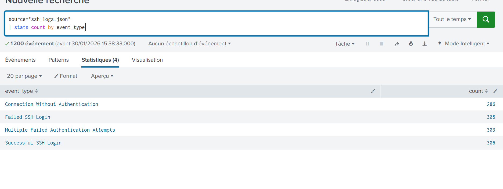

# Lesson — SSH Log Analysis Using Splunk

## Objective

This lesson explains how SSH logs are analyzed in Splunk to detect suspicious behavior. You will learn what different SSH event types mean and how to use SPL queries to monitor activity over time.

By the end of this lesson, you will understand:

- Common SSH security events  
- How attackers behave during SSH reconnaissance and attacks  
- How to analyze SSH activity using Splunk pipelines  
- How to detect suspicious patterns using time-based analysis  

---
.

## Part 1 — Understanding SSH Event Types

SSH logs record different types of activity. Each event represents a specific action performed by a user or automated system.

---

### Successful SSH Login

This event means:

> A user successfully authenticated and accessed the server.

What happened:

- Username and password (or key) were accepted  
- SSH session was established  

SOC interpretation:

- Normal for administrators and automation tools  
- Suspicious if coming from unknown IPs  
- Dangerous if it happens after multiple failed attempts  

---

### Failed SSH Login

This event means:

> A login attempt failed due to wrong credentials.

What happened:

- Wrong password or username  
- Authentication rejected  

SOC interpretation:

- Few failures may be normal  
- Many failures from the same IP indicate brute-force attempts  
- Multiple IPs failing simultaneously may indicate password spraying  

---

### Multiple Failed Authentication Attempts

This event means:

> Several failed login attempts occurred in a short period.

What happened:

- Automated tools tried many passwords  
- Repeated authentication failures were detected  

SOC interpretation:

- Strong indicator of brute-force attack  
- Requires immediate investigation or blocking  

---

### Connection Without Authentication

This event means:

> An SSH connection was opened but authentication was never completed.

What happened:

- Connection started  
- No username or password was submitted  
- Session closed early  

Common causes:

- SSH scanning  
- Banner grabbing  
- Reconnaissance activity  
- Automated probing tools  

SOC interpretation:

- Early attack phase  
- Indicates reconnaissance or server scanning  
- Often appears before brute-force attacks  

---

## Part 2 — SPL Query Pipeline Explanation

Splunk processes queries using pipelines. Each command performs one operation and passes results to the next stage.

Example structure:

Search → Filter → Aggregate → Sort → Visualize

---

## Query 1 — Event Distribution Overview

### SPL Query

```spl
source="ssh_logs.json"
| stats count by event_type
What This Does

Reads SSH log events

Groups logs by event type

Counts how many times each event occurred

Purpose:

Understand overall SSH activity distribution

Identify how many attack-related events exist

Query 2 — Track Unauthenticated Connections Over Time
SPL Query
source="ssh_logs.json"
event_type="Connection Without Authentication"
| timechart count by id.orig_h

What This Query Shows

This query answers:

Which IP addresses are repeatedly opening SSH connections without authenticating, and when did it happen?

Explanation
source="ssh_logs.json"

Selects SSH log data from the dataset.

event_type="Connection Without Authentication"

Filters only events where:

SSH connection was opened

Authentication was not completed

timechart count by id.orig_h

Creates a time-based chart showing:

Number of unauthenticated SSH connections

Grouped by source IP address

Displayed across time intervals

What This Means in Security Analysis

If an IP shows repeated activity such as:

10.0.0.14 → 13 connections


It usually indicates:

SSH scanning

Automated probing

Early-stage attack reconnaissance

This behavior is not normal user activity.

SOC Investigation Workflow

SOC analysts typically:

Detect scanning activity

Check for failed login attempts from same IP

Monitor for brute-force behavior

Verify if successful login occurred afterward

Take response actions

This creates a detection chain:

Scan → Failed Login → Multiple Failures → Successful Compromise

Important Monitoring Indicators

While analyzing SSH logs, analysts should monitor:

Repeated unauthenticated connections

High failed login counts

Successful logins from unknown IPs

Sudden spikes in SSH activity

Repeated access to multiple servers

Conclusion

SSH log analysis using Splunk allows SOC analysts to detect reconnaissance activity, brute-force attempts, and suspicious login behavior. By combining event filtering and time-based analysis, security teams gain visibility into attack patterns and can respond early to potential threats.
Key Takeaways

SSH logs reveal attacker behavior patterns

Connection Without Authentication indicates scanning activity

Failed logins indicate brute-force attempts

timechart helps detect abnormal behavior over time

Pipeline commands allow structured data analysis

