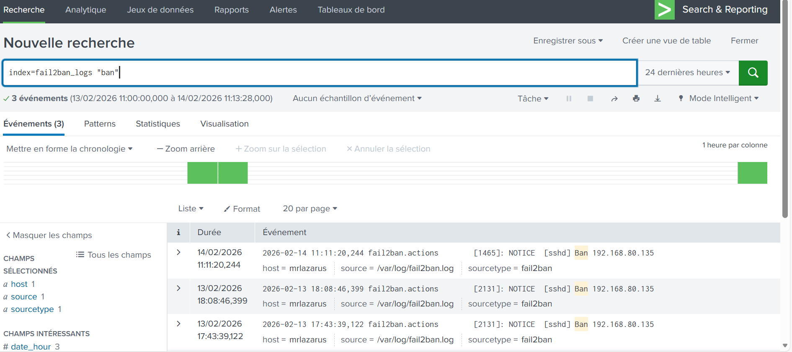
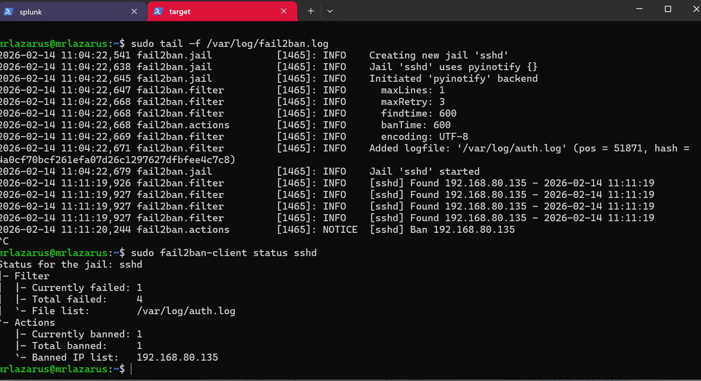
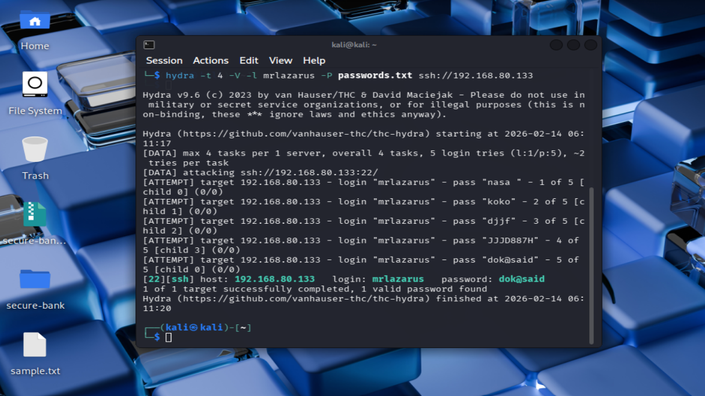

# 🔐 Fail2Ban + Splunk: SSH Brute-Force Detection & Auto-Blocking (Lab)

## Overview
This lab demonstrates an end-to-end workflow:
**Attack → Detection → Automated Response → SIEM Visibility**.

- **Fail2Ban** detects repeated SSH authentication failures and bans the attacker IP.
- **Splunk Universal Forwarder** ships `/var/log/fail2ban.log` to Splunk.
- **Splunk SIEM** provides search/investigation visibility.

## Lab IPs
| Machine | Role | IP |
|---|---|---|
| Splunk SIEM | Splunk Enterprise | 192.168.80.130 |
| Ubuntu Agent | SSH + Fail2Ban + Splunk Forwarder | 192.168.80.133 |
| Kali Linux | Attacker (Hydra) | 192.168.80.135 |

## Attack Simulation (Kali)
```bash
hydra -t 4 -V -l admin -P passwords.txt ssh://192.168.80.133
Fail2Ban Verification (Ubuntu Agent)
sudo fail2ban-client status sshd
sudo tail -f /var/log/fail2ban.log
Splunk Verification
index=fail2ban_logs
```
Forwarder input (Ubuntu Agent):
```
[monitor:///var/log/fail2ban.log]
disabled = false
sourcetype = fail2ban
index = fail2ban_logs
```
Fail2Ban jail:
```bash
[sshd]
enabled = true
port = ssh
logpath = /var/log/auth.log
maxretry = 3
findtime = 600
bantime = 600
```
MITRE ATT&CK Mapping
T1110 — Brute Force

T1078 — Valid Accounts (if successful login happens)




